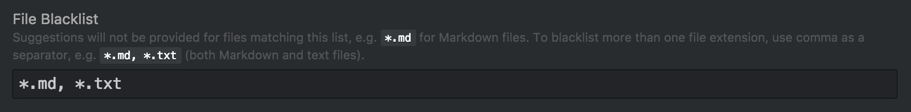

I don't intend to blog often, but will if I have any compelling ideas, thoughts to share with the world. Hopefully it happens more often than I think it will.

## Weekend Project

This site is a weekend project in an attempt to learn more web technologies. Since I primarily do systems level programming I figured it would be useful to get my feet wet with React. It has certainly been a humbling experience because I have **A LOT** to learn when it comes to web technologies.

## How did I get started?
It seemed like React was the new *hotness* so I figured I'd try it. I found the [reactiflux discord](https://discord.gg/CNdSkN) and saw some of their learning resources. I ended up watching some react videos and walking through the basics at [reactjs.org](https://reactjs.org/).

I was planning on making a Heroes of the Storm timer app as my first project, but also realized I could make a personal site for myself. (Something I've been putting off for years) So here we are, and as you can see its not the most beautiful site in the world. I hope to touch it up as I learn more.

## Config for Atom that changed my life

### Disable Autocomplete-plus on certain file types
I've finally had enough of Atom suggesting text when I'm typing up documentation / just using Atom as a notepad. (I swear it has become a habit to hit my escape key, to close the autocomplete suggestion, when I type.)

The package `autocomplete-plus` should be installed as a `Core Package` for you. Find that package and add `*.md, *.txt` and any other file extensions to be on the `File Blacklist`.



### Soft wrap on specific file markdown
The default settings for soft wrap are all encompassing by default, which is not what I wanted given sometimes its nice to see code as its written. Markdown was one place where I wanted a soft wrap by default and I was annoying toggling the default settings in my Atom editor every time I typed up markdown.

Open up your Atom config, it should open a file called `config.cson`.

Put this at the the left most level indentation:
```json
".gfm.source":
  editor:
    softWrapAtPreferredLineLength: true
```
